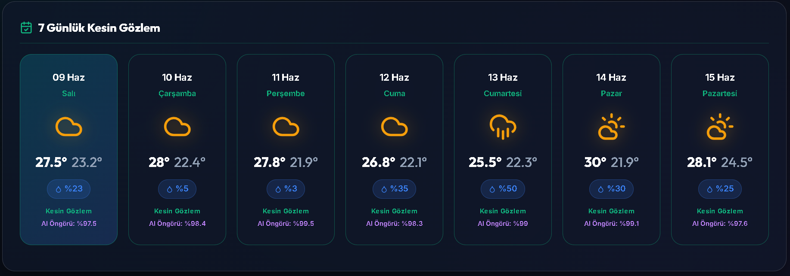
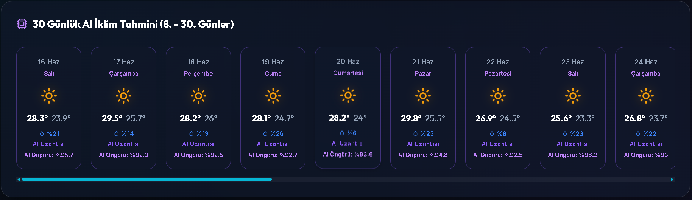
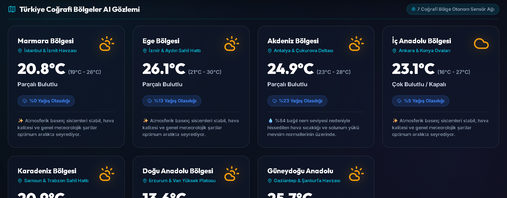
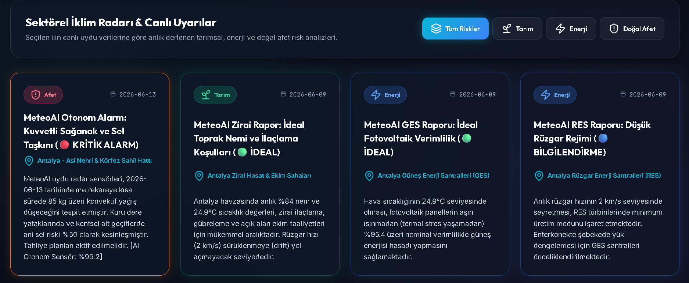
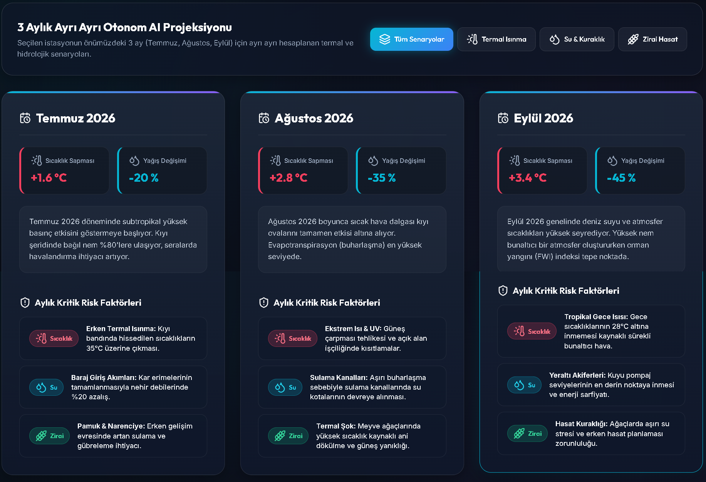
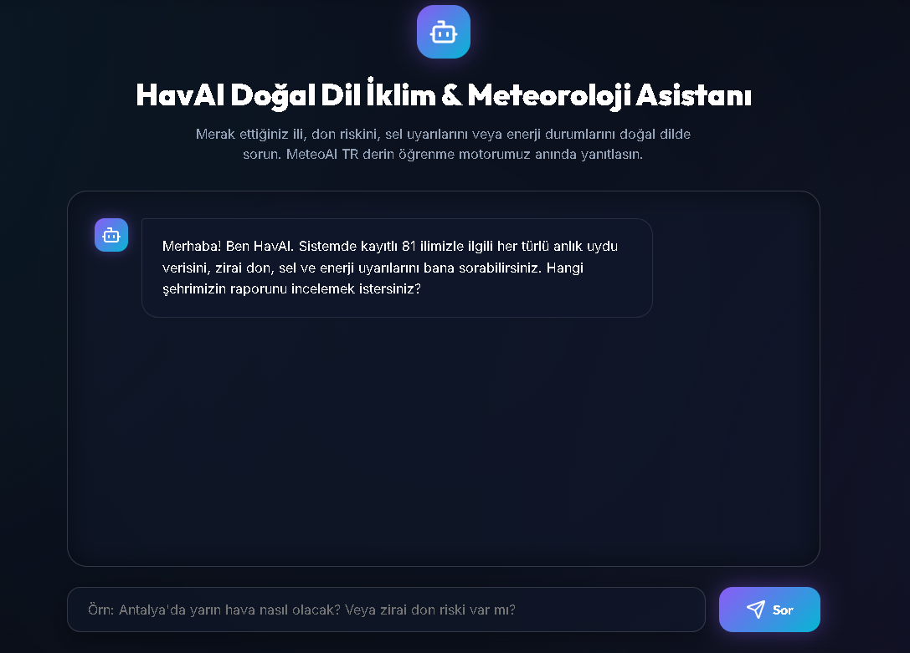
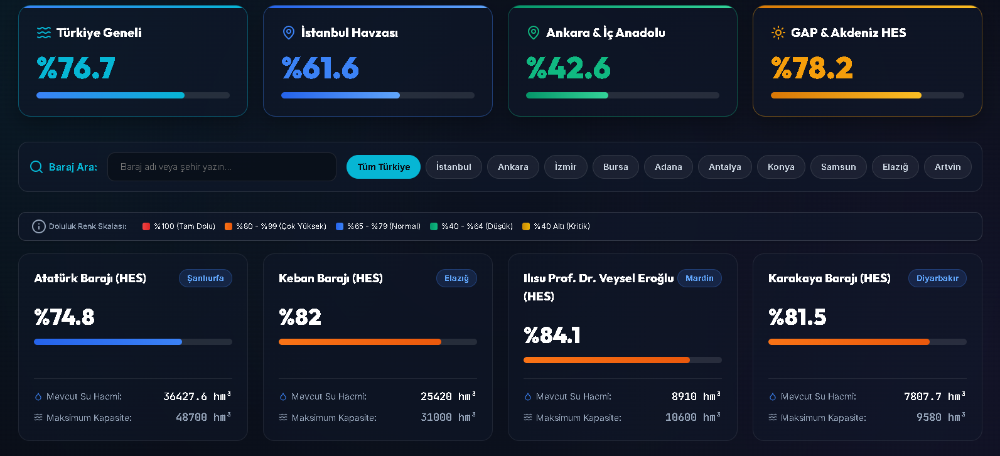
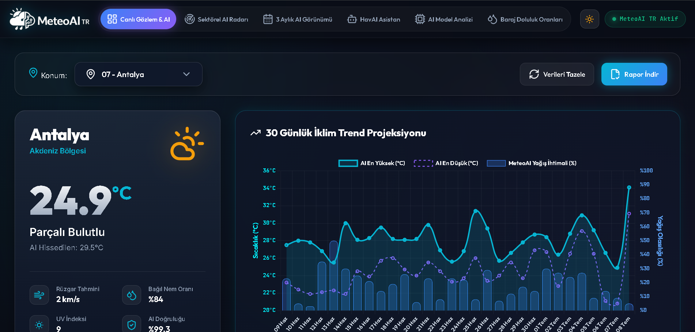

# MeteoAI TR - Yapay Zeka Destekli İklim & Meteoroloji Sistemi

MeteoAI TR, canlı hava durumu verileri, baraj doluluk oranları ve bölgesel iklim analizlerini kullanıcılara sunan, aynı zamanda meteorolojik sorularınıza yapay zeka destekli yanıtlar verebilen modern bir web uygulamasıdır. Progressive Web App (PWA) altyapısı sayesinde mobil ve masaüstü cihazlara kurulabilir.

## 🌟 Özellikler

- **Canlı Hava Verisi:** Anlık olarak güncellenen hava durumu bilgileri.
- **Baraj Doluluk Oranları:** Barajların güncel doluluk verilerini takip etme imkanı.
- **Bölgesel Hava Verisi:** Belirli bölgelere özel detaylı hava durumu tahminleri ve analizleri.
- **Yapay Zeka Asistanı:** Meteoroloji ve hava durumu ile ilgili sorularınızı yapay zekaya sorabilme.
- **Koyu / Açık Tema (Dark & Light Mode):** Kullanıcı tercihine veya sistem saatine göre arayüz temasını gündüz/gece moduna geçirebilme özelliği.
- **PWA Desteği:** Çevrimdışı çalışabilme ve cihazlara yerel bir uygulama gibi yüklenebilme (Service Worker & Manifest).
- **Rapor İndirme:** Hava durumu ve baraj analiz raporlarını cihazınıza indirebilme (`rapor_indir.php`).

## 📁 Proje Yapısı

- `/api` - API uç noktaları (Hava verisi çekme, baraj verileri ve yapay zeka entegrasyonu PHP dosyaları).
- `/assets` - CSS stilleri, JavaScript dosyaları ve uygulama simgeleri.
- `/cache` - Performansı artırmak için oluşturulan önbelleklenmiş JSON dosyaları.
- `index.php` - Ana uygulama sayfası.
- `sw.js` & `manifest.json` - PWA (Progressive Web App) yapılandırma dosyaları.

## 🚀 Kurulum & Çalıştırma

1. Projeyi bilgisayarınıza klonlayın:
   ```bash
   git clone https://github.com/mehmetdmrc/METEOAI-iklim-ve-hava-durumu.git
   ```
2. Projeyi bir PHP sunucusunun kök dizinine (örneğin XAMPP için `htdocs`, WAMP için `www` klasörüne) kopyalayın.
3. Gerekliyse `/api/veritabani_kurulumu.php` dosyasını çalıştırarak veritabanı kurulumunuzu yapın.
4. Tarayıcınızdan `http://localhost/meteoroloji` gibi ilgili dizine giderek uygulamayı çalıştırın.

## 🛠 Kullanılan Teknolojiler

- **Frontend:** HTML5, CSS3, Vanilla JavaScript
- **Backend:** PHP
- **Mimari:** Progressive Web App (PWA)

## 📸 Ekran Görüntüleri

*Aşağıdaki görsellere tıklayarak tam boyutlu olarak inceleyebilirsiniz.*

<details>
  <summary><b>Uygulama İçi Görselleri Görmek İçin Tıklayın</b></summary>
  <br>
  
  
  
  
  
  
  
  
  
</details>